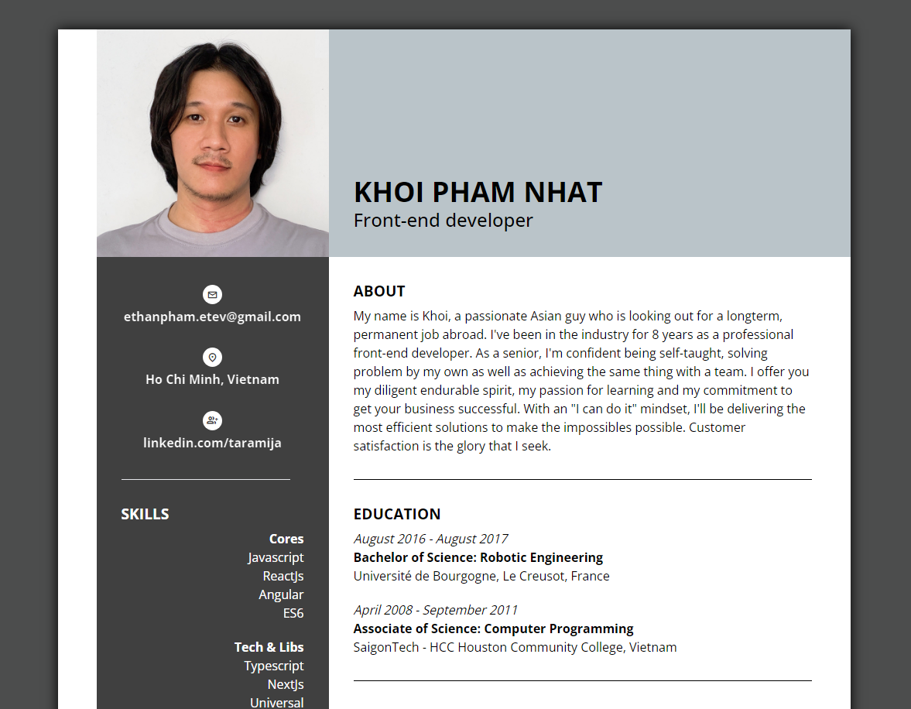

# HTML + Tailwindcss

# Online CV

## Overview

> This project provides FE source code for CV online of Ethan based on HTML & tailwindcss only

## Crossbrowsers support

> The browser version must at least match the below chart or above for the `animation` to work properly

|         |     |
| ------- | --: |
| Chrome  |  20 |
| Firefox |  28 |
| Safari  | 6.1 |
| Edge    |  12 |
| IE      |  11 |
| Opera   |  12 |

## Packages & Dependencies

This project was used with:

|                                                      |        |
| ---------------------------------------------------- | ------ |
| [Node](https://nodejs.org/)                          | 14.0.0 |
| [Package Manager](https://www.npmjs.com/package/npm) | 7.18.1 |

## Run development server

### Auto reload

1. Run `yarn` to install dependencies
2. Run `yarn start`
3. Navigate to (http://10.2.0.2:8080) or (http://192.168.2.5:8080) or (http://127.0.0.1:8080)

## Build

The app is plain html so it is the build version itself

### Thank you for your visiting!
